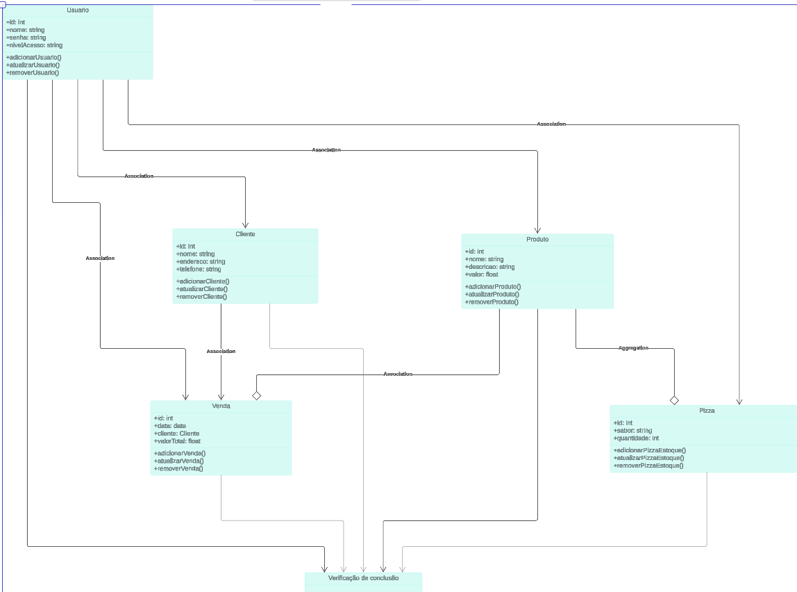
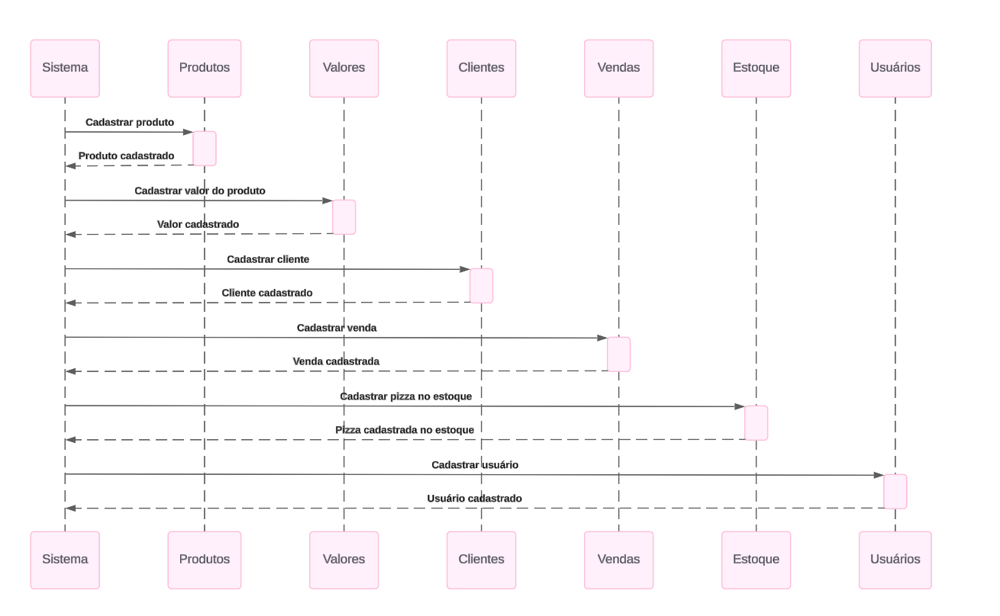

# 🍕 **Pizza UDV API**

**Pizza API** é uma aplicação RESTful moderna e eficiente para gerenciar uma promoção beneficente de Pizzas. A API cobre desde o gerenciamento de estoque de produtos até a criação e venda de pizzas, oferecendo suporte completo para cadastro de clientes e controle de pedidos.

> **Status do Projeto**: 🚀 Em desenvolvimento..

---

## 📚 **Sumário**
1. [📖 Visão Geral](#-visão-geral)
2. [⚙️ Recursos](#️-recursos)
3. [🛠️ Tecnologias Utilizadas](#-tecnologias-utilizadas)
4. [📋 Estrutura de Diretórios](#-estrutura-de-diretórios)
5. [📄 Endpoints](#-endpoints)
6. [📊 Diagramas](#-diagramas)
7. [💻 Como Executar](#-como-executar)
8. [🤝 Contribuição](#-contribuição)
9. [📞 Contato](#-contato)

---

## 📖 **Visão Geral**

Esta API foi desenvolvida para atender às principais demandas de uma pizzaria, como:
- Controle de estoque de ingredientes.
- Gerenciamento de pizzas disponíveis para venda.
- Cadastro de clientes.
- Controle de vendas, reduzindo automaticamente o estoque de pizzas.

Com uma arquitetura bem definida e moderna, a API segue as melhores práticas de desenvolvimento, incluindo:
- Padrão RESTful.
- Validações robustas.
- Segurança por meio de autenticação JWT.

---

## ⚙️ **Recursos**

- **Gerenciamento de Produtos**: Cadastro e controle de ingredientes para calcular os custos das pizzas.
- **Controle de Pizzas**: Cadastro de sabores e gerenciamento do estoque.
- **Cadastro de Clientes**: Gerenciamento de informações dos clientes.
- **Registro de Vendas**: Criação de vendas que vinculam clientes e pizzas, reduzindo o estoque automaticamente.
- **Validações de Dados**: Garantia de integridade e consistência nas operações.
- **Segurança**: Proteção com autenticação JWT e controle de acesso por níveis de permissão.

---

## 🛠️ **Tecnologias Utilizadas**

| Tecnologia           | Descrição                              |
|----------------------|----------------------------------------|
| **Node.js**          | Ambiente de execução JavaScript.       |
| **Express.js**       | Framework para construção da API.      |
| **MongoDB**          | Banco de dados NoSQL para persistência.|
| **Mongoose**         | ODM para modelagem de dados no MongoDB.|
| **JWT**              | Autenticação segura baseada em tokens. |
| **Docker** (opcional)| Containerização para fácil deploy.     |

---

## 📋 **Estrutura de Diretórios**

```bash
📦 projeto-pizza-api
├── 📁 diagramas         # Diagramas de classes e ER
├── 📁 src
  ├── 📁 config           # Banco de Dados
  ├── 📁 controllers      # Lógica dos endpoints
  ├── 📁 models           # Modelos de dados (Mongoose)
  ├── 📁 routers          # Rotas da aplicação
  ├── 📁 middlewares      # Validações e autenticação
  ├── 📁 services         # Funções utilitárias
  ├── main.js             # Ponto de entrada da aplicação
└── README.md           # Documentação do projeto
```

---

## 📄 **Endpoints**

### **Produtos**
| Método | Endpoint       | Descrição                            |
|--------|----------------|--------------------------------------|
| `GET`  | `/produtos`    | Lista todos os produtos.            |
| `POST` | `/produtos`    | Cadastra um novo produto.           |
| `PUT`  | `/produtos/:id`| Atualiza um produto existente.      |
| `DELETE`| `/produtos/:id`| Remove um produto do estoque.       |

### **Pizzas**
| Método | Endpoint      | Descrição                            |
|--------|---------------|--------------------------------------|
| `GET`  | `/pizzas`     | Lista todas as pizzas disponíveis.  |
| `POST` | `/pizzas`     | Cadastra uma nova pizza.            |
| `PUT`  | `/pizzas/:id` | Atualiza os dados de uma pizza.     |
| `DELETE`| `/pizzas/:id` | Remove uma pizza do sistema.        |

### **Clientes**
| Método | Endpoint       | Descrição                           |
|--------|----------------|-------------------------------------|
| `GET`  | `/clientes`    | Lista todos os clientes.           |
| `POST` | `/clientes`    | Cadastra um novo cliente.          |
| `PUT`  | `/clientes/:id`| Atualiza os dados de um cliente.   |
| `DELETE`| `/clientes/:id`| Remove um cliente do sistema.      |

### **Vendas**
| Método | Endpoint       | Descrição                           |
|--------|----------------|-------------------------------------|
| `GET`  | `/vendas`      | Lista todas as vendas realizadas.  |
| `POST` | `/vendas`      | Registra uma nova venda.           |

---

## 📊 **Diagramas**

- **Diagrama de Classes**  
  Representa as entidades do sistema e suas relações.  
  Localizado em: `📁 diagramas/Diagrama-Classe.png`.

- **Diagrama de Entidade-Relacionamento (ER)**  
  Mostra o fluxo de interações entre os componentes da API.    
  Localizado em: `📁 diagramas/Diagrama-Sequencia.png`.

### **Prévia**  
  


---

## 💻 **Como Executar**

### **Pré-requisitos**
- Node.js instalado (v18 ou superior).
- MongoDB em execução.
- Git instalado.

### **Passo a Passo**
1. Clone o repositório:
   ```bash
   git clone https://github.com/seu-usuario/projeto-pizza-api.git
   cd projeto-pizza-api
   ```

2. Instale as dependências:
   ```bash
   npm install
   ```

3. Configure as variáveis de ambiente:
   - Crie um arquivo `.env` com os valores necessários:
     ```
     PORT=3000
     MONGODB_URI=mongodb://localhost:27017/pizza-api
     JWT_SECRET=sua_chave_secreta
     ```

4. Execute a aplicação:
   ```bash
   npm start
   ```

5. Acesse a API em:  
   ```
   http://localhost:3000
   ```

---

## 🤝 **Contribuição**

Contribuições são bem-vindas! Siga os passos abaixo:
1. Fork este repositório.
2. Crie uma branch para sua feature: `git checkout -b minha-feature`.
3. Faça commit das suas alterações: `git commit -m 'Adiciona minha feature'`.
4. Envie para o repositório remoto: `git push origin minha-feature`.
5. Crie um Pull Request.

---

## 📞 **Contato**

📧 E-mail: reinald_30_2009@hotmail.com  
🌐 GitHub: [Reinald Mendes](https://github.com/ReinaldMendes)  
📱 LinkedIn: [Reinald Mendes](https://www.linkedin.com/in/reinald-mendes-b712b9182/)

---

> **"Uma boa pizza é como um bom software: simples, mas com ingredientes perfeitos!"**

🍕 Feito com ❤️ por [Reinald Mendes].
```

---

